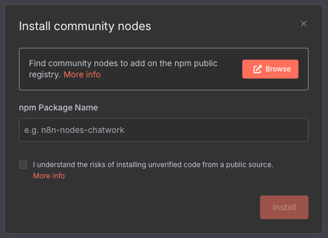
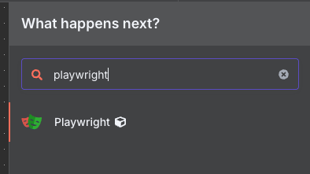

# n8n Custom Image with Playwright

This is a custom n8n docker configuration with support for playwright. The official n8n images are built on Alpine Linux which has limited support for playwright. This image switches out the base image for Debian and installs all dependencies required for playwright.

This will allow you to use the [n8n-nodes-playwright](https://github.com/n8n-io/n8n-nodes-playwright) community node on your self hosted n8n instance.

## 🚀 Quick Start

1. **Initialize environment variables:**

   ```bash
   make env-init ENV=local
   ```

2. **Build the base Docker image:**

   ```bash
   make build
   ```

3. **Start n8n locally:**

   ```bash
   make start ENV=local
   ```

4. **Access n8n:**
   Open your browser and go to [http://localhost:5678](http://localhost:5678)

## Project Structure

```bash
n8n-custom/
├── Dockerfile.base              # Custom Dockerfile with Playwright support
├── docker-entrypoint.sh         # Custom entrypoint script
├── Makefile                     # All commands in one file
├── n8n-task-runners.json        # Task runner configuration
├── package.json                 # Node.js dependencies
├── docker-compose.local.yml     # Local environment configuration
├── docker-compose.production.yml # Production environment configuration
├── .env.local.sample            # Sample environment variables for local
└── .env.production.sample       # Sample environment variables for production
```

## Available Commands

Run `make help` to see all available commands:

```bash
make help
```

### Building and Managing Images

```bash
# Build the base image (default: n8n-custom-base:latest)
make build

# Build with specific tag
make build TAG=v1.0

# Build with date-based versioning
make build-dated

# Push to a container registry
make push
```

### Environment Management

```bash
# Copy sample environment files
make env-init ENV=local
make env-init ENV=production

# Generate secure encryption key
make gen-key

# Generate secure JWT secret
make gen-jwt
```

### Container Operations

```bash
# Start environments
make start ENV=local
make start ENV=production

# Stop environments
make stop ENV=local
make stop ENV=production

# View logs
make logs ENV=local

# Restart containers
make restart ENV=local

# Create backups
make backup ENV=local
make backup ENV=production
```

### Updating

```bash
# Update to latest n8n version (builds new image and restarts)
make update ENV=local
```

## Local Environment

The local environment uses SQLite as the database and runs a single n8n instance. It's ideal for development and testing purposes.

## Production Environment

The production environment uses PostgreSQL and Redis for the database and queue. It's designed for production use cases with better performance and reliability.

For production, make sure to set secure encryption keys and JWT secrets:

```bash
make gen-key
make gen-jwt
```

Copy the generated values to your `.env.production` file.

## Scripts

The `scripts/` directory contains utility scripts for managing your n8n deployment:

### Backup Scripts

- **`backup-n8n.sh`** - Automated backup script that creates compressed backups of n8n data
  - Creates timestamped backup files in `/opt/apps/n8n/backups/`
  - Automatically removes old backups (keeps last 7)
  - Logs backup operations
  
- **`n8n-backup.cron`** - Cron job configuration for automated daily backups
  - Runs backup script daily at 2 AM
  - Install with: `sudo cp scripts/n8n-backup.cron /etc/cron.d/n8n-backup`

## Install n8n-nodes-playwright

Once you have the image built, and n8n is running you can install the n8n-nodes-playwright node by going to Settings > Community Nodes and add n8n-nodes-playwright.



### Playwright Node Usage

Once you have the node installed, you can use it in a workflow by going to the n8n-nodes-playwright node and adding a new playwrightnode.




